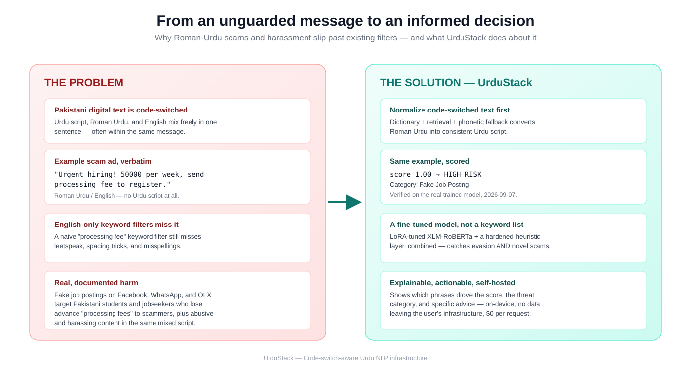
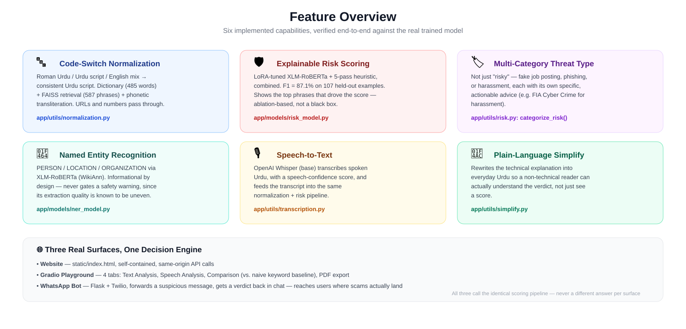
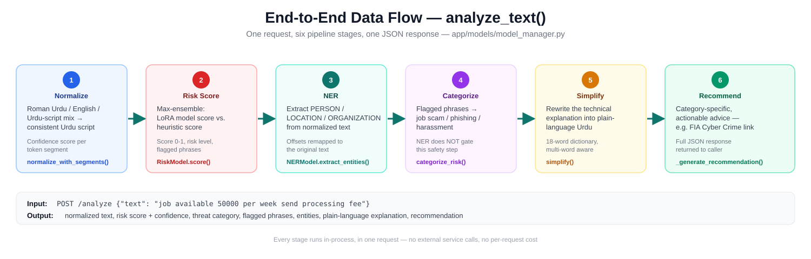
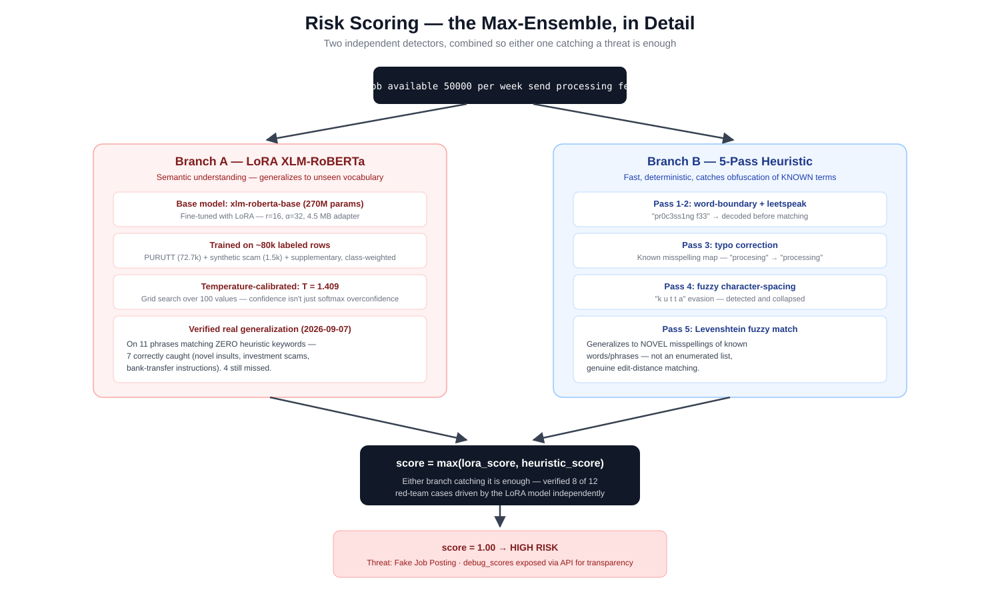
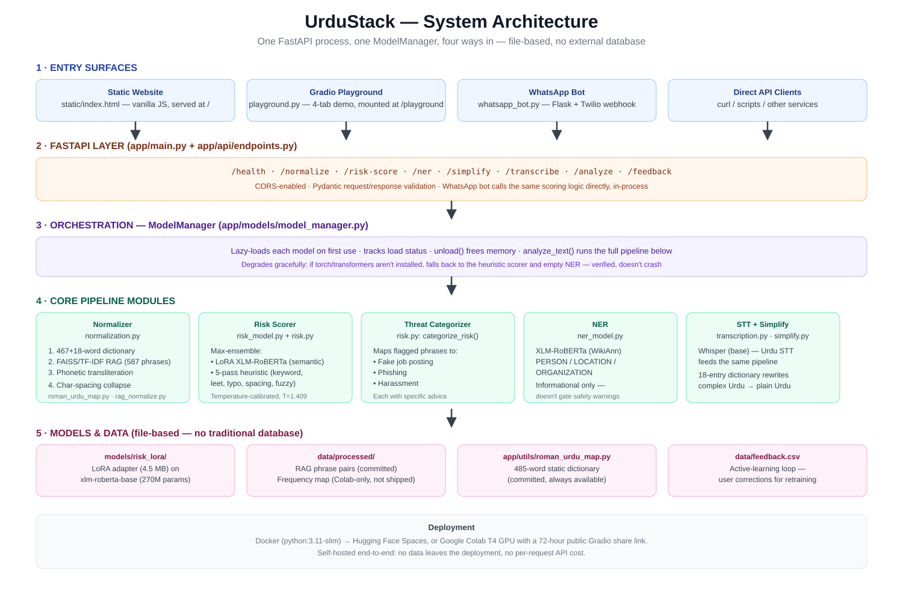
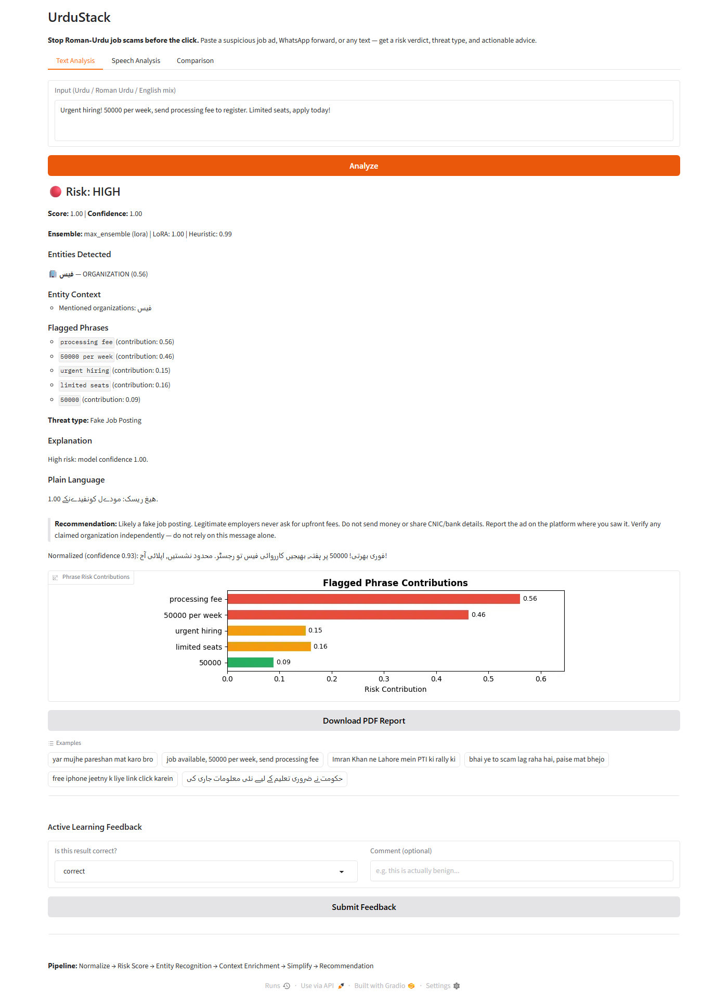
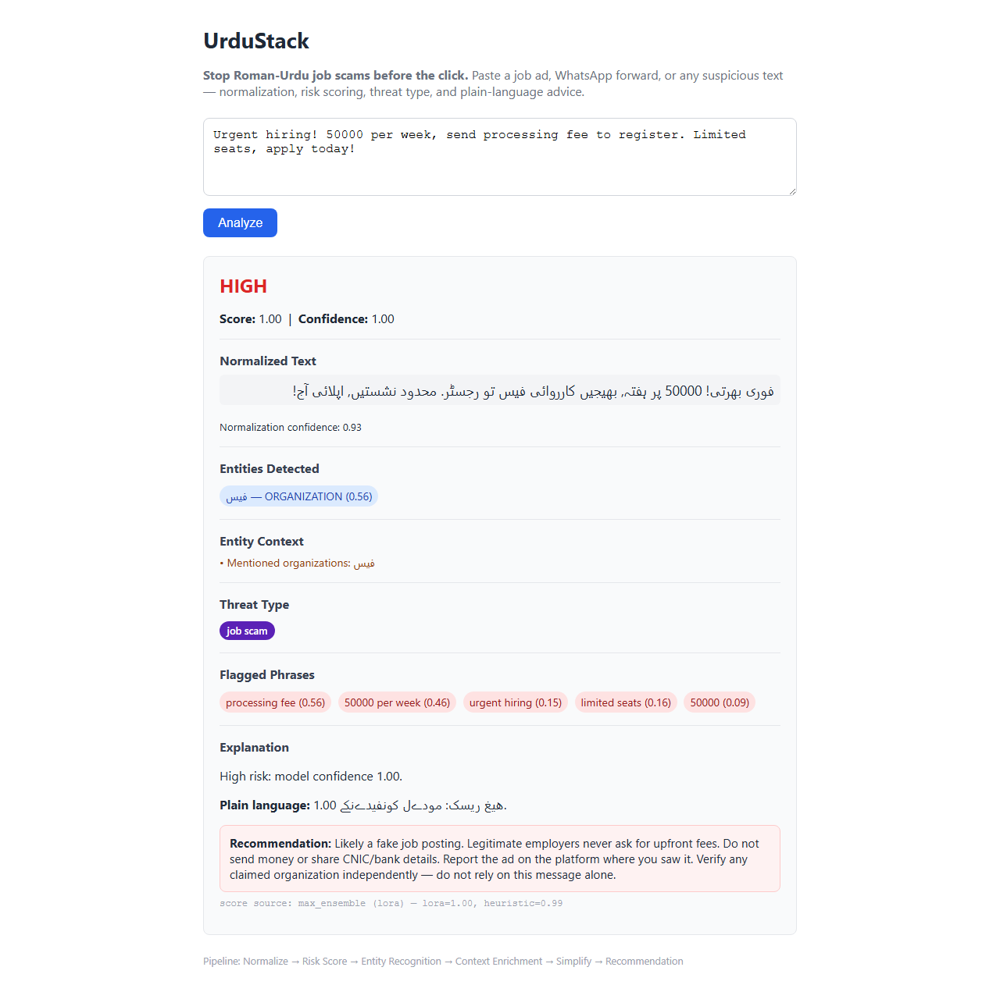
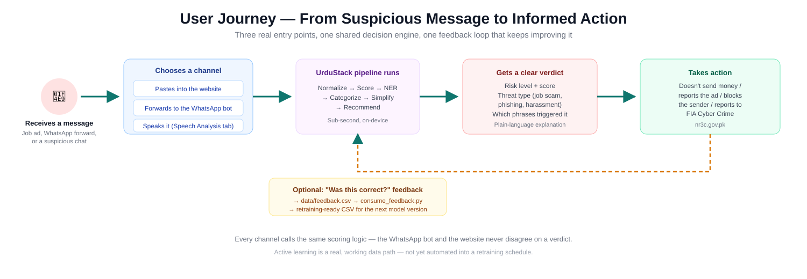

# UrduStack

### Stop Roman-Urdu job scams before the click.

UrduStack is a self-hosted, code-switch-aware NLP pipeline that detects scam and toxic content in
mixed **Urdu script / Roman Urdu / English** text — the way Pakistani digital text is actually
written — and explains its verdict in plain language, with a specific, actionable next step.

<p>
  
  
  
  
</p>

📄 [Full Technical Report](docs/report/UrduStack_Technical_Report.pdf) ·
📊 [Presentation](docs/presentation/UrduStack_Presentation.pptx) ·
🖼 [Architecture Diagrams](docs/diagrams/)

---

## Table of Contents

- [The Problem](#the-problem)
- [The Solution](#the-solution)
- [Why Not Just Ask GPT-4o?](#why-not-just-ask-gpt-4o)
- [Key Features](#key-features)
- [How It Works](#how-it-works)
- [System Architecture](#system-architecture)
- [Technology Stack](#technology-stack)
- [Screenshots &amp; Demo](#screenshots--demo)
- [Getting Started](#getting-started)
- [API Reference](#api-reference)
- [Project Structure](#project-structure)
- [Testing &amp; Validation](#testing--validation)
- [Real-World Benefits](#real-world-benefits)
- [Known Limitations](#known-limitations)
- [Roadmap](#roadmap)
- [Contributors](#contributors)
- [License](#license)

---

## The Problem

A real scam job posting, seen verbatim during this project's development:

> *"Urgent hiring! 50000 per week, send processing fee to register."*

This sentence is entirely Roman Urdu and English — no Urdu script at all — yet it carries a scam
pattern any Pakistani reader recognizes instantly: an advance-fee request tied to a fake job. English
keyword filters miss it, or are trivially evaded with leetspeak (`pr0c3ss1ng f33`), spacing tricks
(`p r o c e s s i n g   f e e`), or misspellings (`procesing fee`). Fake job postings on Facebook,
WhatsApp, and OLX target Pakistani students and jobseekers this way, alongside abusive and harassing
content in the same mixed script.

## The Solution



UrduStack normalizes code-switched text into consistent Urdu script first, then classifies it with a
**LoRA-fine-tuned XLM-RoBERTa model combined with a hardened heuristic layer** — not a keyword list —
and returns a plain-language explanation plus a specific recommendation. Everything runs on-device.

## Why Not Just Ask GPT-4o?

UrduStack runs on-device with a 4.5 MB LoRA adapter — no API keys, no paid calls per request, no data
leaving your infrastructure. That matters for harassment reports and scam complaints people don't
want sent to a third-party API.

| | UrduStack | GPT-4o (via API) |
|---|---|---|
| **Model size** | 4.5 MB adapter | Proprietary (billions of params) |
| **Cost per request** | $0 | ~$0.01–0.03 |
| **Data stays local** | Yes | No |
| **Latency** | Sub-second | 1–3 seconds |
| **Offline capable** | Yes | No |
| **Roman Urdu slang** | Trained on it | Not head-to-head tested — plausible, not measured |

The LoRA adapter achieves **F1 = 87.1%** (precision 92.5%, recall 82.2%) on the full 107-example test
set — verified against the real trained adapter, not a mock:
[`tests/eval_metrics_full_t0.4.json`](tests/eval_metrics_full_t0.4.json). The deployed max-ensemble
(LoRA + heuristic) passes **12/12** on the original red-team suite, also re-verified against the real
model: [`tests/adversarial_results_model.csv`](tests/adversarial_results_model.csv). On a separate set
of novel phrases matching none of the heuristic's keywords, the trained model alone correctly
generalizes on 7 of 11 — genuine semantic detection, not keyword matching — with 4 open gaps honestly
tracked, not hidden: [`tests/novel_probe_results.csv`](tests/novel_probe_results.csv).

## Key Features



| Feature | What it does |
|---|---|
| 🔤 **Code-Switch Normalization** | Roman Urdu / English / Urdu script → consistent Urdu script (485-word dictionary + FAISS retrieval + phonetic fallback) |
| 🛡️ **Explainable Risk Scoring** | LoRA model + 5-pass heuristic ensemble; shows exactly which phrases drove the score |
| 🏷️ **Multi-Category Threat Type** | Fake job posting, phishing, or harassment — each with specific advice |
| 👤 **Named Entity Recognition** | PERSON / LOCATION / ORGANIZATION — informational, never gates a safety warning |
| 🎙️ **Speech-to-Text** | OpenAI Whisper transcribes spoken Urdu into the same pipeline |
| 💬 **Plain-Language Simplify** | Rewrites the technical verdict into everyday Urdu |

## How It Works



1. **Paste a message** — a job ad, WhatsApp forward, or any suspicious text.
2. **Normalize** — code-switched text becomes consistent Urdu script.
3. **Risk score** — the max-ensemble flags scam/toxic content with a calibrated confidence.
4. **Categorize** — fake job posting, phishing, or harassment.
5. **Simplify & recommend** — a plain-language explanation and a specific next step.

```
Input: "job available 50000 per week send processing fee"
Output: score 1.00 → HIGH RISK → "Fake Job Posting"
        → "Legitimate employers never ask for upfront fees.
           Report the ad. Verify any claimed organization independently."
```

### The Risk-Scoring Ensemble, in Detail



Two independent detectors run on every request; the higher score wins. This is verified to matter in
practice — the trained LoRA model independently drives 8 of the 12 correct scores on the adversarial
suite, while the heuristic layer catches obfuscation (leetspeak, spacing) the model alone doesn't
reliably resolve.

## System Architecture



One FastAPI process, one `ModelManager` orchestrating lazily-loaded models, four ways in, no
traditional database — state is file-based (a committed dictionary, a committed FAISS index, and a
CSV feedback log). See the [full architecture diagram set](docs/diagrams/) and the
[technical report](docs/report/UrduStack_Technical_Report.pdf) for complete detail.

## Technology Stack

| Layer | Technology |
|---|---|
| API framework | FastAPI + Pydantic, Uvicorn |
| ML framework | PyTorch, Hugging Face Transformers, PEFT (LoRA) |
| Risk model | `xlm-roberta-base` (270M params) + LoRA adapter (4.5 MB) |
| NER | XLM-RoBERTa fine-tuned on WikiAnn |
| Speech-to-text | OpenAI Whisper (base) |
| Retrieval | FAISS (`IndexFlatIP`) + character-trigram TF-IDF |
| Demo UI | Gradio 6.x (4-tab interface) |
| Distribution | Flask + Twilio (WhatsApp bot), vanilla JS static site |
| Testing | pytest (46 unit tests), custom adversarial/regression harnesses |
| CI | GitHub Actions |
| Deployment | Docker (`python:3.11-slim`) → Hugging Face Spaces, or Colab T4 GPU |

## Screenshots & Demo

**The Gradio Playground**, analyzing a real scam message end-to-end — real score, real threat type,
real phrase-level explanation:



**The static website**, same verdict, same backend:



### User Journey



### Live demo (hackathon submission)

Open [`notebooks/launch_demo.ipynb`](notebooks/launch_demo.ipynb) in Google Colab, enable the T4 GPU
runtime, and run all 5 cells. Cell 5 prints a public Gradio URL valid for 72 hours — no login, no
setup required to try it.

## Getting Started

### Run the API locally

```bash
pip install -r requirements.txt
uvicorn app.main:app --reload
```

Open http://127.0.0.1:8000/docs for interactive API documentation, or http://127.0.0.1:8000/ for the
static site.

### Run the Gradio playground

```bash
pip install -r requirements.txt
python playground.py
```

Then open http://localhost:7860.

### Run the WhatsApp bot

```bash
pip install -r requirements.txt
export TWILIO_AUTH_TOKEN=...        # from your Twilio console
export URDUSTACK_API_URL=http://127.0.0.1:8000
python whatsapp_bot.py
```

See [`whatsapp_bot.py`](whatsapp_bot.py) for the full Twilio sandbox setup (join code, webhook URL).

### Run with Docker

```bash
docker build -t urdustack .
docker run -p 7860:7860 urdustack
```

The container exposes port `7860` and runs `app.py`, which mounts the Gradio playground at
`/playground` alongside the FastAPI routes and the static site at `/`.

### Configuration

| Environment variable | Purpose | Default |
|---|---|---|
| `RISK_MODEL_PATH` | Path to the LoRA adapter | `models/risk_lora` |
| `RISK_TEMPERATURE_PATH` | Path to the calibration temperature file | `models/temperature.txt` |
| `CORS_ALLOW_ORIGINS` | Comma-separated allowed origins | `*` |
| `TWILIO_AUTH_TOKEN` | WhatsApp bot auth (Twilio) | — |
| `URDUSTACK_API_URL` | API base URL for the WhatsApp bot / test scripts | `http://localhost:8000` |

## API Reference

| Method | Endpoint | Input | Output |
|---|---|---|---|
| GET | `/health` | — | `{status, models_loaded}` |
| POST | `/normalize` | `{text}` | `{normalized, confidence, segments}` |
| POST | `/risk-score` | `{text}` | `{score, confidence, risk_level, flagged_phrases, threat_categories, explanation, debug_scores}` |
| POST | `/transcribe` | audio file | `{text, confidence}` |
| POST | `/ner` | `{text}` | `{entities}` |
| POST | `/simplify` | `{text}` | `{simplified, changes, complexity}` |
| POST | `/analyze` | `{text}` | Full pipeline (normalize + risk + NER + categorize + simplify + recommend) |
| POST | `/feedback` | `{text, score, confidence, correct_label, comment}` | `{status}` |

**Example:**

```bash
curl -X POST http://127.0.0.1:8000/risk-score \
  -H "Content-Type: application/json" \
  -d '{"text": "job available 50000 per week send processing fee"}'
```

## Project Structure

```
UrduStack/
├── app/
│   ├── main.py                  FastAPI entrypoint (+ CORS, static site mount)
│   ├── api/endpoints.py         8 API routes
│   ├── models/
│   │   ├── risk_model.py        LoRA risk scorer + max-ensemble
│   │   ├── ner_model.py         NER wrapper
│   │   └── model_manager.py     Orchestration, recommendation logic
│   └── utils/
│       ├── normalization.py     Code-switch normalization cascade
│       ├── risk.py              Heuristic scorer, threat categorization
│       ├── simplify.py          Plain-language simplification
│       ├── transcription.py     Whisper speech-to-text
│       └── pdf_report.py        Matplotlib-based PDF export
├── scripts/                     Training, data prep, feedback consumption
├── tests/                       46 unit tests + evaluation/adversarial harnesses
├── docs/
│   ├── diagrams/                6 SVG architecture/workflow diagrams
│   ├── screenshots/             Real, captured UI screenshots
│   ├── presentation/            10-slide hackathon deck (.pptx)
│   └── report/                  Full technical report (.pdf)
├── models/risk_lora/            Trained LoRA adapter (committed)
├── playground.py                4-tab Gradio demo
├── whatsapp_bot.py               Flask + Twilio WhatsApp bot
├── static/index.html            Self-contained website
└── app.py                       HF Spaces entrypoint (mounts everything)
```

## Testing & Validation

```bash
pip install pytest
pytest tests/test_unit.py -v         # 46 unit tests
python tests/test_adversarial_ci.py  # heuristic regression suite (CI-gating)
```

- **46 pytest unit tests** — heuristic scorer, simplifier, preprocessor, typo correction, risk
  categorization, loanword normalization, and a real PDF-generation regression test.
- **Full evaluation against the real trained model**, not a subset or a mock:
  `python tests/run_evaluation.py` (89.7% accuracy, 87.1% F1 on 107 examples).
- **Adversarial red-team suite** re-verified against the deployed ensemble:
  `python tests/run_adversarial_colab.py` (12/12).
- **End-to-end validation performed directly**: a live Uvicorn server hit over real HTTP, the
  WhatsApp bot's webhook exercised with a real POST request, and the Gradio playground driven with a
  headless browser through a full analysis and PDF download.

Full methodology and results: [technical report, §16–18](docs/report/UrduStack_Technical_Report.pdf).

## Real-World Benefits

- **Protects an underserved population** — Roman-Urdu speakers fall through the gap between
  English-only moderation and Urdu-script-only tools.
- **Explainable, not a black box** — users see *why* a message was flagged, which builds trust and
  teaches pattern recognition over time.
- **Meets people where scams land** — website, Gradio demo, and a WhatsApp bot, not locked behind a
  developer-only API.
- **Zero marginal cost, private by design** — self-hosted, no per-request fee, no third-party data
  sharing.
- **Extensible** — the same architecture applies to other code-switched, under-resourced languages,
  and the multi-category detector already has synthetic training data for 7 scam types (3 currently
  wired into the live categorizer).

## Known Limitations

Reported with the same rigor as the results above — every number below is from a committed,
reproducible test run, not an estimate.

- **A direct death threat scores low (0.10)**, even from the trained model — the single most
  important open finding in this project. See
  [`tests/novel_probe_results.csv`](tests/novel_probe_results.csv).
- **Short-input false positives, not yet patched.** A legitimate university fee mention scores 0.98
  HIGH; bare numbers score 1.00 HIGH; the single word "salary" scores 0.99. Not a "numbers" bug
  specifically (`"12345"` alone scores 0.01) — deliberately left unpatched rather than adding a
  keyword/length override that could suppress genuinely correct short-text catches elsewhere.
- **NER extraction quality is uneven** on this pipeline's normalized text (it no longer gates any
  safety message because of this — see the technical report, §9.2).
- **Frequency map (Tier-1 normalization) is not shipped** — built on Colab from 6.37M sentences, too
  large to commit; the system falls back to the 485-word static dictionary + FAISS retrieval.
- **No formal head-to-head comparison against a frontier LLM** — the cost/latency/privacy advantages
  above are structural; accuracy has not been measured side-by-side.
- **WhatsApp bot is demo-time only** — functional and tested, not yet a persistent deployment.

Full detail: [technical report, §19](docs/report/UrduStack_Technical_Report.pdf).

## Roadmap

- [ ] Retrain the risk classifier with expanded short-text negative examples and threat vocabulary to
      close the death-threat and short-input false-positive gaps.
- [ ] Ship the full Tier-1 frequency map (or document it clearly as a Colab-only build step).
- [ ] Deploy the WhatsApp bot as a persistent, always-on service.
- [ ] Extend multi-category detection to the remaining 4 synthetic scam categories (lottery, charity,
      investment, loan).
- [ ] Run a reproducible head-to-head evaluation against a frontier LLM API.
- [ ] Automate the active-learning feedback loop into a scheduled retraining pipeline with model
      versioning.

## Contributors

| Name | Role |
|---|---|
| **Shahoud Shahid** | Development |
| **Munaza Tariq** | Development |

## License

MIT — see [LICENSE](LICENSE).
