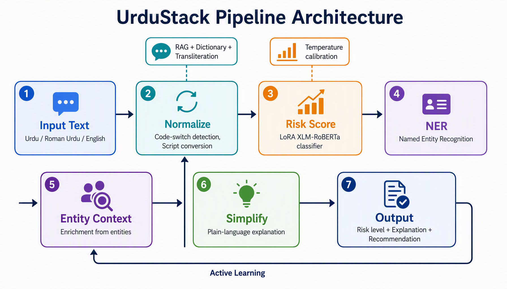

# UrduStack

**Stop Roman-Urdu job scams before the click.**

Fake job postings on Facebook, WhatsApp, and OLX targeting Pakistani
students and jobseekers are a documented, growing harm. Scammers post
ads like _"Urgent hiring! 50000 per week, send processing fee to
register"_ in Roman Urdu — a script that slips past English-only
keyword filters and Urdu-script classifiers alike.

UrduStack is a self-hosted, code-switch-aware NLP pipeline that
detects scam and toxic content in mixed Urdu / Roman Urdu / English
text, classifies the threat type (fake job posting, phishing, or
harassment), and gives the reader specific, actionable advice.

## How it works

1. **Paste a message** — a job ad, WhatsApp forward, or any suspicious text.
2. **UrduStack normalizes** code-switched text (Roman Urdu → Urdu script).
3. **Risk scoring** flags scam/toxic content with a calibrated confidence score.
4. **Threat classification** identifies the category: fake job posting, phishing, or harassment.
5. **Actionable advice** — e.g. "Legitimate employers never ask for upfront fees. Report the ad."



## Why not just ask GPT-4?

UrduStack runs on-device with a 4.5 MB LoRA adapter — no API keys,
no paid calls per request, no data leaving your infrastructure. This
matters for harassment reports and scam complaints people don't want
sent to a US cloud API.

| | UrduStack | GPT-4o (via API) |
|---|---|---|
| **Model size** | 4.5 MB adapter | Proprietary (billions of params) |
| **Cost per request** | $0 | ~$0.01–0.03 |
| **Data stays local** | Yes | No |
| **Latency** | Sub-second | 1–3 seconds |
| **Roman Urdu slang** | Trained on it | Inconsistent |
| **Offline capable** | Yes | No |

The LoRA adapter achieves **F1 = 85.0%** (precision 97.0%, recall
75.6%) on a 97-example test set. The heuristic fallback catches
adversarial evasion (leetspeak, spacing, typos) at **12/12 red-team
cases**.

## Multi-category threat detection

UrduStack doesn't just say "risky" — it identifies the threat type
and gives specific advice:

| Threat type | Example detection | Advice given |
|---|---|---|
| **Fake job posting** | "50000 per week send processing fee" | Never pay upfront fees; report the ad |
| **Phishing** | "click here to claim prize" | Don't click links; verify via official site |
| **Harassment** | "kutta kamina" | Block sender; report to FIA Cyber Crime |

Categories are ranked by total risk contribution so the most dangerous
threat is addressed first.

## Distribution

UrduStack can be deployed where the harm actually happens:

- **WhatsApp bot** (`whatsapp_bot.py`) — Twilio sandbox integration.
  Forward a suspicious job ad from WhatsApp, get an instant verdict.
- **FastAPI endpoints** — integrate into any app via `/risk-score`
  and `/analyze`.
- **Gradio playground** — standalone web UI for demos and evaluation.

## Live demo

Open [`notebooks/launch_demo.ipynb`](notebooks/launch_demo.ipynb) in
Google Colab, enable the T4 GPU runtime, and run all 5 cells. After
3–5 minutes, cell 5 prints a public URL like:

    Running on public URL: https://<hash>.gradio.live

That URL is valid for **72 hours** and can be shared with anyone — no
login, no setup. If it expires, re-run the notebook to get a fresh one.

### What the evaluator sees

- **Text Analysis**: paste text → normalized Urdu, risk score,
  threat category (job scam / phishing / harassment), phrase-level
  contributions, NER entities, and plain-language recommendation.
- **Speech Analysis**: record or upload Urdu audio → Whisper
  transcription → same analysis pipeline.
- **Comparison**: naive English keyword baseline vs. UrduStack —
  shows where normalization + fine-tuned model catches scams the
  baseline misses.

## API endpoints

| Method | Endpoint | Input | Output |
|---|---|---|---|
| GET | `/health` | — | `{status, models_loaded}` |
| POST | `/normalize` | `{text}` | `{normalized, confidence, segments}` |
| POST | `/risk-score` | `{text}` | `{score, confidence, risk_level, flagged_phrases, threat_categories, explanation}` |
| POST | `/transcribe` | audio file | `{text, confidence}` |
| POST | `/ner` | `{text}` | `{entities}` |
| POST | `/simplify` | `{text}` | `{simplified, changes, complexity}` |
| POST | `/analyze` | `{text}` | Full pipeline (normalize + risk + NER + simplify) |
| POST | `/feedback` | `{text, label, ...}` | `{stored}` |

## Project structure

```
app/
  api/         FastAPI routers
  models/      ML model definitions and checkpoints
  data/        Datasets and processed data
  utils/       Normalization, risk scoring, transcription helpers
scripts/       Training and data-preparation scripts
playground.py  Standalone Gradio UI
whatsapp_bot.py  WhatsApp bot (Twilio sandbox)
tests/         Adversarial red-teaming cases
```

## Run locally

```bash
pip install -r requirements.txt
uvicorn app.main:app --reload
```

Open http://127.0.0.1:8000/docs for interactive API documentation.

## Run the playground

```bash
pip install -r requirements.txt
python playground.py
```

Then open http://localhost:7860.

## Run the WhatsApp bot

See [`whatsapp_bot.py`](whatsapp_bot.py) for Twilio sandbox setup.
Requires `TWILIO_AUTH_TOKEN` and `URDUSTACK_API_URL` environment variables.

## Build with Docker / Hugging Face Spaces

```bash
docker build -t urdustack .
docker run -p 7860:7860 urdustack
```

The container exposes port `7860` and runs `app.py`, which mounts the Gradio playground at `/` and keeps the FastAPI routes under `/health`, `/normalize`, `/risk-score`, `/transcribe`.

## Under the hood

### Core infrastructure
- [x] FastAPI endpoints: `/health`, `/normalize`, `/risk-score`, `/transcribe`
- [x] Code-switch-aware normalizer (dictionary + RAG + phonetic transliteration)
- [x] Frequency map builder (`scripts/build_normalizer_map.py` — runs on Colab, JSON not committed)
- [x] Synthetic scam data generator (7 categories: job, lottery, phishing, investment, charity, shopping, loan)
- [x] Speech-to-text via Urdu Whisper
- [x] Named Entity Recognition (XLM-RoBERTa WikiANN)
- [x] Lexical simplification for plain-language explanations
- [x] Retrieval-augmented normalization (FAISS char-ngram index, seeded with 124 entries beyond static dict → 587 total phrases)

### Risk model
- [x] LoRA fine-tuned XLM-RoBERTa on PURUTT (72.7k samples, 5 epochs)
- [x] Temperature calibration (T=1.41)
- [x] Metrics: accuracy 88.8%, precision 97.0%, recall 75.6%, F1 85.0%
- [x] Max-ensemble scoring (LoRA + heuristic, takes higher score)
- [x] Four-pass heuristic detection: word-boundary regex, leetspeak normalization, typo correction (48 misspellings), fuzzy character-spacing regex
- [x] Multi-category threat classification (job scam, phishing, harassment)
- [x] Category-specific actionable recommendations
- [x] Ablation-based phrase contribution scoring
- [x] Class-weighted loss + early stopping

### Demo and evaluation
- [x] Unified Gradio dashboard (text, speech, comparison tabs)
- [x] Naive keyword baseline vs. full pipeline comparison mode
- [x] Active learning feedback loop (Gradio widget → CSV → retrain)
- [x] Visual explainability (phrase contribution bar chart)
- [x] PDF report export
- [x] Colab launch notebook with auto-detect model files
- [x] Adversarial red-teaming harness
- [x] WhatsApp bot (Twilio sandbox)
- [x] 42 pytest unit tests (heuristic scorer, simplifier, preprocessor, typo correction, risk categorization)
- [x] Committed eval metrics JSON with real numbers
- [x] Spacing evasion mitigation (character-collapse preprocessing)
- [x] Architecture diagram

### Deployment
- [x] Docker-ready (`docker build -t urdustack .`)
- [x] Colab Gradio `share=True` for live public demo (72h URL)
- [x] HF Hub model card for LoRA adapter
- [x] All model files committed to repo (no manual upload needed)

### Known limitations
- **Recall gap:** 75.6% recall — model favors precision (97.0%) to
  avoid false positives.
- **Character-spaced evasion:** "k u t t a" style attacks mitigated by
  fuzzy character-spacing regex in the heuristic scorer and
  preprocessing collapse. Passes adversarial tests.
- **Domain shift:** Trained on social media text; formal/literary Urdu
  may perform differently.
- **Frequency map:** Tier-1 lookup built on Colab but not committed to
  repo; normalizer falls back to 467-word dictionary + RAG (seeded with
  124 additional domain-specific entries, 587 total phrases) + transliteration.

## Testing

### Unit tests
```bash
pip install pytest
pytest tests/test_unit.py -v
```
42 tests covering the heuristic scorer (8 tests), risk level thresholds
(3), pattern inventory (4), typo correction (6), risk categorization (6),
lexical simplifier (8), spacing-collapse preprocessor (4), and script
detection (3). Normalization tests skip gracefully when numpy is not
installed.

### Full evaluation (requires GPU)
```bash
python tests/run_evaluation.py              # all 97 examples
python tests/run_evaluation.py --mode adversarial  # 12 red-team cases
python tests/run_adversarial_colab.py       # standalone adversarial runner
```

### Evaluation results

The trained LoRA adapter achieves on a 97-example test set:

| Metric | Score |
|---|---|
| Accuracy | 88.8% |
| Precision | 97.0% |
| Recall | 75.6% |
| F1 | 85.0% |

Full metrics: [`tests/eval_metrics_full_t0.4.json`](tests/eval_metrics_full_t0.4.json)

### Adversarial red-team results

The heuristic scorer with four-pass detection (word-boundary regex,
leetspeak normalization, typo correction, fuzzy character-spacing regex)
passes **12/12** adversarial cases, including leetspeak, character spacing,
misspellings, mixed-script, and Roman-Urdu scam phrasing. The max-ensemble
(LoRA + heuristic) is expected to match or exceed this on Colab GPU.
Re-run with `tests/run_adversarial_colab.py` to verify with the trained adapter.
